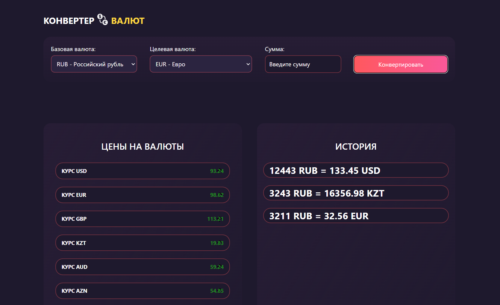

# Конвертер Валют

Добро пожаловать в Конвертер Валют! Это веб-приложение, которое позволяет вам легко конвертировать валюты и отслеживать текущие курсы обмена. В этом README.md файле мы разберем основной функционал приложения.

## Основной функционал

### Получение курсов валют

При запуске приложения, оно выполняет запрос к API Центрального банка России, чтобы получить актуальные курсы обмена валют. Эти курсы обновляются автоматически и предоставляют информацию о следующих валютах:

- Российский рубль (RUB)
- Доллар США (USD)
- Евро (EUR)
- Фунт стерлингов (GBP)
- Казахстанский тенге (KZT)
- Австралийский доллар (AUD)
- Азербайджанский манат (AZN)
- Армянский драм (AMD)
- Белорусский рубль (BYN)
- Китайский юань (CNY)

### Конвертация валют

Приложение позволяет вам конвертировать RUB - Российский рубль валюту в другую. Для этого вы должны выбрать базовую валюту (из которой вы хотите конвертировать) и целевую валюту (в которую вы хотите конвертировать). Затем введите сумму в базовой валюте и нажмите кнопку "Конвертировать". После этого приложение выполнит конвертацию и отобразит результат.

### Отслеживание изменения курсов

Приложение также позволяет вам отслеживать изменения курсов. Для этого в информере отображается текущий курс для каждой валюты, и он изменяется в цвете, чтобы показать, повысился ли курс (зеленый цвет) или упал (красный цвет).

### История конвертаций

Вы также можете просматривать историю ваших конвертаций. После нажатия кнопки "Конвертировать", результат конвертации добавляется в историю, которую можно увидеть в разделе "История". Вы можете удалить записи из истории, наведя указатель мыши на запись и нажав на "УДАЛИТЬ".

## Используемые технологии

- HTML
- CSS
- JavaScript
- Fetch API для запросов к API Центрального банка России

## Как запустить приложение

1. Загрузите все файлы приложения (HTML, CSS, JavaScript).
2. Откройте HTML-файл в веб-браузере.

## Зависимости

Приложение не требует установки дополнительных зависимостей, так как оно использует только встроенные браузерные функции и данные из API Центрального банка России.

## Автор

Это приложение разработано **Алтынбаевым Русланом** в качестве учебного проекта.

